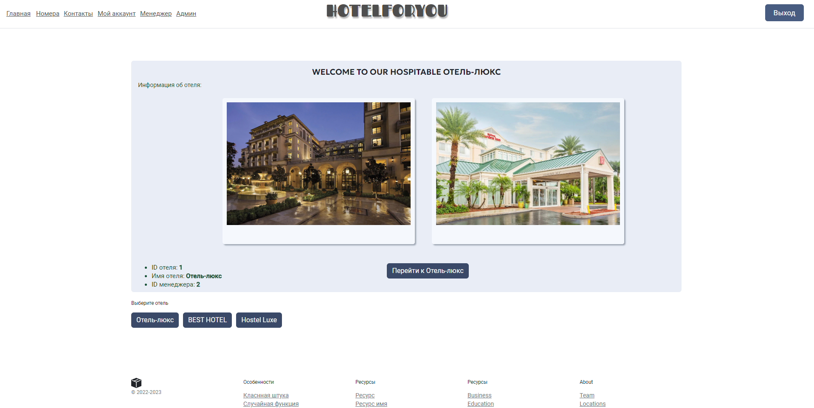
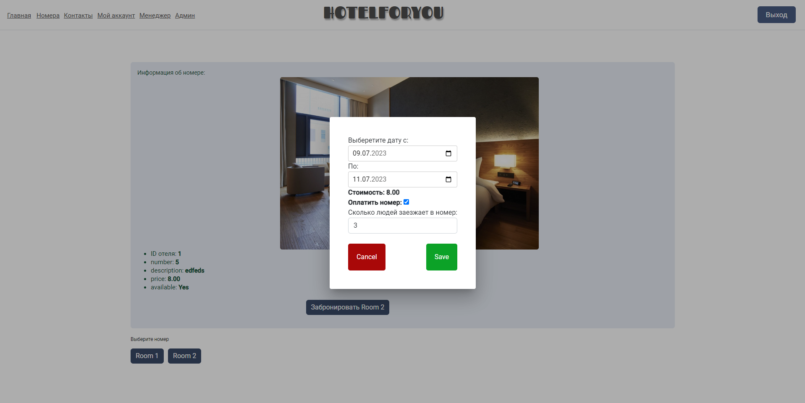
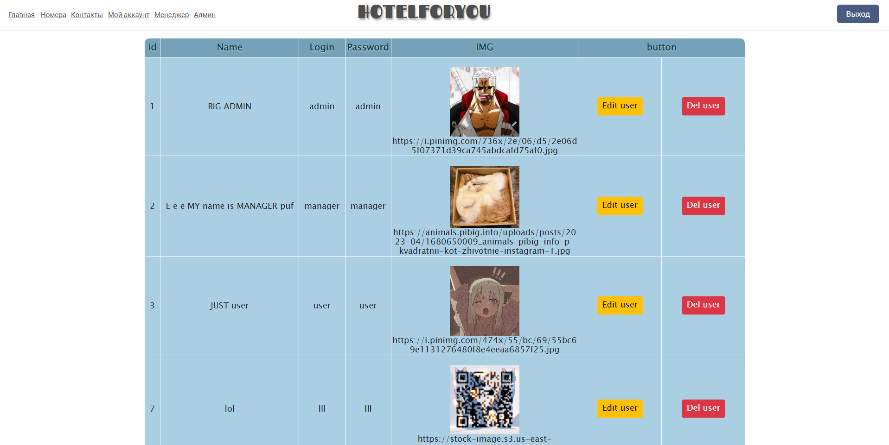
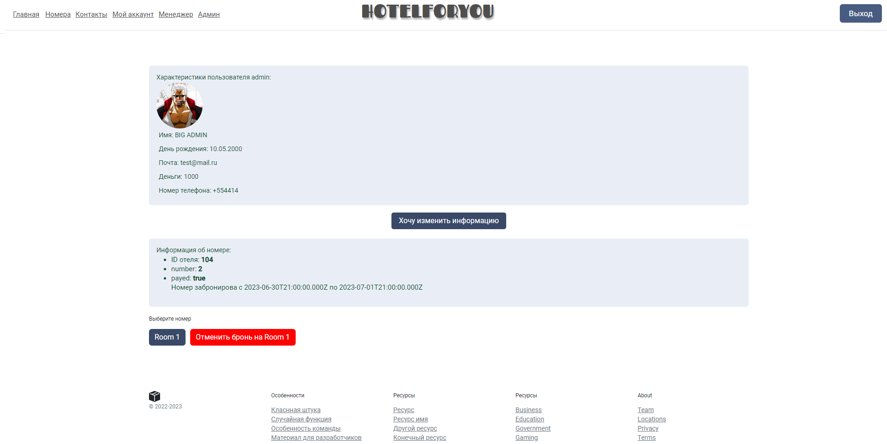

# Описание проекта HOTEL
Это проект "Бронирование отелей". Есть объект отель, у этого объекта есть номера, а у номеров в свою очередь есть описание.

Для взаимодейсвия с отелем и номерами есть разные сущности: user, admin, manager.

User может: забронировать номера на определённый срок.

Manager может: забронировать номера на определённый срок, удалить/добавить новою сущность: отель и номера в этом отеле.

Admin может: забронировать номера на определённый срок, удалить/добавить новою сущность: отель и номера в этом отеле, также admin может добавить нового пользователя и назначить ему роль: user, manager.

## Используемые технологии:
- Angular
- Node.js
- Express
- PostgreSQL 14
- Typescript
- Pino

## Запуск 
-Скомпилировать и запустить [сервер ](https://github.com/bublik-liquidator/backend-for-Hotel): файл index.ts, в консоле `npx tsc` затем `npm run dev`.  
-Запуск клиентской части: в консоле `ng serve`. Перейдите к `http://localhost:4200 /`. Приложение автоматически перезагрузится, если вы измените какой-либо из исходных файлов.

## ВАЖНОЕ
Проект модернизируется поэтому возможны разлчие баги, в случае обнаружения таковых просьба пнуть меня

## Внешний вид
-Главная страница

-Момент бронирования комнаты в отеле

-Страница manager

-Страница admin

-Аккаунт пользователя с ролью admin

